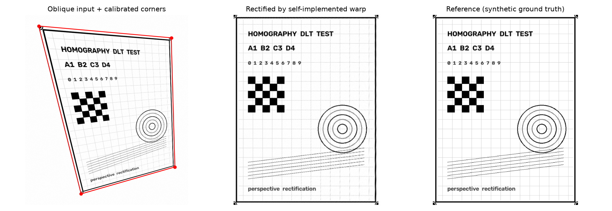
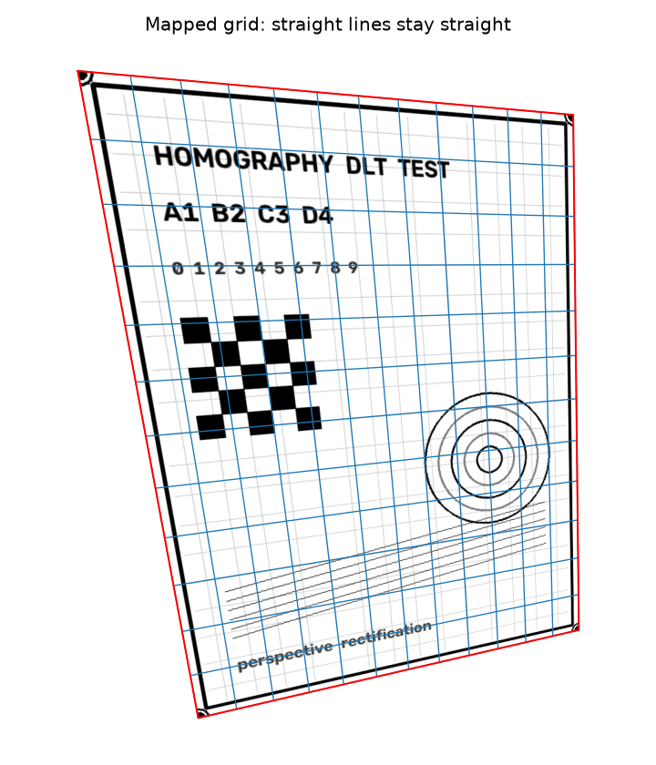
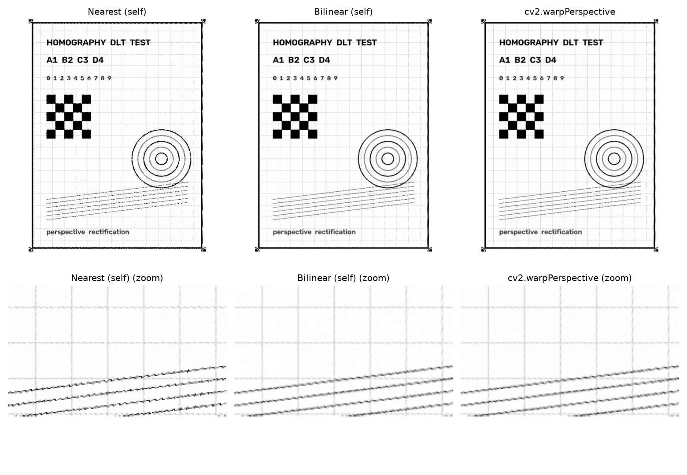
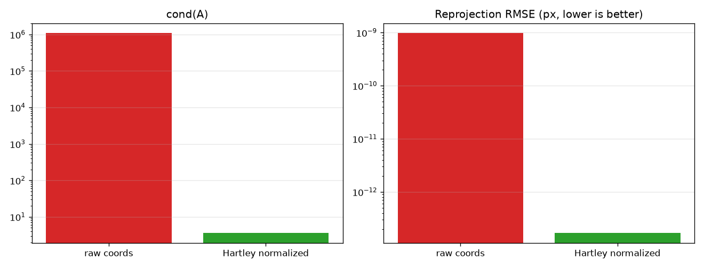
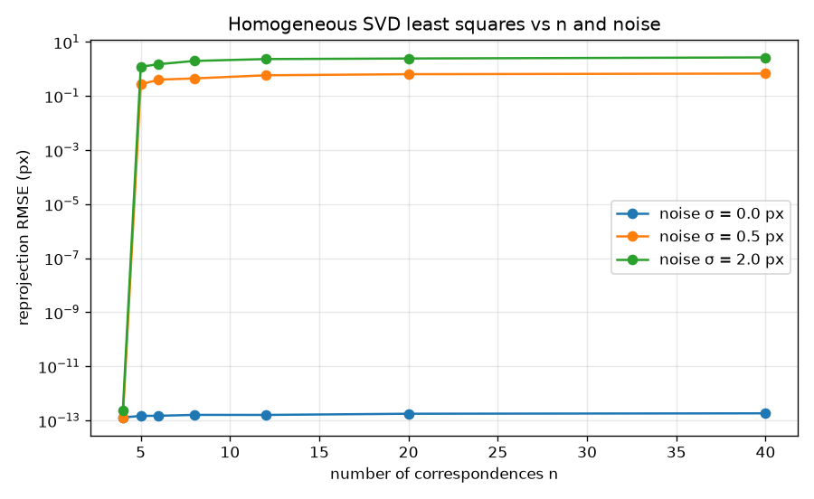

# CV1 · 第一章加分作业：射影矩阵（单应矩阵）自编程实现

[](https://www.python.org/)
[](https://numpy.org/)
[](https://opencv.org/)

用**自编程**的方式求解射影矩阵 $H$，把斜向拍摄的平面照片矫正为正视图，并输出分辨率、像素矩阵与四个角点坐标。

核心求解流程（$A$ 矩阵构造、Hartley 归一化、SVD 零空间求解、反归一化、图像重采样）**全部手写**，未调用 `cv2.getPerspectiveTransform` / `findHomography` / `warpPerspective` / `remap`。

---

## 目录

- [1. 作业要求与实现边界](#1-作业要求与实现边界)
- [2. 快速开始](#2-快速开始)
- [3. 目录结构](#3-目录结构)
- [4. 核心结果](#4-核心结果)
- [5. 算法原理](#5-算法原理)
- [6. 对照实验](#6-对照实验)
- [7. 输出说明](#7-输出说明)
- [8. 文档索引](#8-文档索引)
- [9. 局限与可扩展方向](#9-局限与可扩展方向)

---

## 1. 作业要求与实现边界

作业要求分三步：

| 作业要求 | 本项目对应实现 |
|---|---|
| **① 图像预处理**：斜向图片、适当降分辨率、得出像素矩阵、标定四个角点，正视照片角点固定 | 合成 3 组斜视图（含解析真值）+ 支持实拍图交互标定；输出分辨率、像素矩阵（`.npy`）、四角点坐标（`.json`） |
| **② 算法原理解析**：自编程实现射影矩阵求解，由 4 组对应点构造 $\mathbf{A}\vec h=0$（$8\times9$）并求解 | `code/homography.py`：手写 $A$ 构造 + Hartley 归一化 + SVD 齐次求解 + 反归一化；另实现 $h_{33}=1$ 非齐次解作为对照 |
| **③ 输出要求**：输出分辨率、像素矩阵、四角点坐标与正图象素矩阵 | `output/` 下四类产物齐全，见 [第 7 节](#7-输出说明) |

**自编程边界**

| 手写实现（算法本体） | 允许调用的原语 | 禁止调用 |
|---|---|---|
| $A$ 矩阵构造、Hartley 归一化与反归一化、SVD 齐次求解全流程、$h_{33}=1$ 非齐次解、$3\times3$ 伴随矩阵求逆、**逆映射 + 双线性插值重采样**、重投影误差与 $H$ 距离 | `numpy.linalg.svd`、`cv2.imread/imwrite/resize/cvtColor/setMouseCallback/绘图` | `cv2.getPerspectiveTransform`、`cv2.findHomography`、`cv2.remap`；`cv2.warpPerspective` 仅用于生成测试数据与独立交叉验证 |

> 核验命令：`grep -rn "getPerspectiveTransform\|findHomography\|remap\|warpPerspective" code/`
> 结果：前三者完全不出现；`warpPerspective` 只出现在 `synth.py`（造数据）与 `experiments.py`（交叉验证），交付算法路径 `warp.py` / `homography.py` 未使用。

---

## 2. 快速开始

```bash
# 1) 安装依赖（建议虚拟环境）
python -m venv .venv
.venv\Scripts\activate          # Windows
python -m pip install -r requirements.txt -i https://pypi.tuna.tsinghua.edu.cn/simple

# 2) 环境自检（第一个该跑的脚本，会纯数值地验证求解器）
python code/check_env.py

# 3) 一键跑通全流程：生成数据 → 对照实验 → 批量矫正
python code/main.py --synth --experiments --batch --max-side 700
```

预期在第 2 步看到：

```
[4] 核心算法自检
    齐次 SVD 重投影 RMSE : 2.050e-13 px
    与构造真值的距离     : 3.391e-15
    [OK] 求解器正常
```

**单张图 / 实拍图**

```bash
# 交互标定四角（顺序：左上 → 右上 → 右下 → 左下）
python code/pick_corners.py --image data/oblique/my_photo.jpg --max-side 700

# 用角点文件跑主流程
python code/main.py --image data/oblique/my_photo.jpg \
                    --corners data/corners/my_photo.json --max-side 700
```

> 在 PyCharm 里操作请见 [PyCharm使用与操作手册.md](PyCharm使用与操作手册.md)，里面有逐步骤的界面操作、6 个运行配置、调试技巧与讲解提纲。

---

## 3. 目录结构

```
.
├─ README.md                    本文件
├─ PyCharm使用与操作手册.md       PyCharm 操作 / 调试 / 讲解指南
├─ 报告.md                       实验报告（原理推导 + 实验 + 误差分析）
├─ 执行计划.md                   技术决策、验收指标、执行步骤
├─ 第一章加分作业.md             作业原文（含校对修正）
├─ requirements.txt              依赖清单
├─ code/
│  ├─ check_env.py       环境自检 + 求解器最小验证
│  ├─ homography.py      ★ 核心：A 构造 / Hartley 归一化 / SVD 求解 / 8 元对照 / 求逆 / 误差 / 诊断
│  ├─ warp.py            ★ 核心：目标尺寸估计 / 逆映射 + 双线性插值 / 共线性度量
│  ├─ preprocess.py      兼容中文路径读写 / 灰度 / 降采样 / 角点读写 / 矩阵导出 / PSNR
│  ├─ synth.py           合成文档图 + 解析真值 H0 + 斜视图生成 + 噪声注入
│  ├─ experiments.py     4 组对照实验 + 管线验证 + 出图
│  ├─ main.py            端到端 CLI（--synth / --experiments / --batch / 单张）
│  └─ pick_corners.py    鼠标交互角点标定
├─ data/
│  ├─ reference/         正向文档图 doc_gray.png + <名称>_H0.json（解析真值）
│  ├─ oblique/           斜视图（合成 3 张；实拍照片放这里）
│  └─ corners/           <名称>.json 四角点坐标
└─ output/
   ├─ images/            斜图（含角点）、正视图、最近邻对照、512×512、实验图
   ├─ matrices/          *.npy 完整像素矩阵（已 .gitignore，可重新生成）
   ├─ preview/           *.csv 降采样数值表（已 .gitignore）
   └─ metrics/           experiments.json + 每张图的 run.json
```

---

## 4. 核心结果

### 4.1 矫正效果



左：斜向输入 + 标定的四角点；中：本实现（手写逆映射 + 双线性）输出的正视图；右：合成参考图。

### 4.2 关键指标

| 指标 | 结果 | 说明 |
|---|---|---|
| 4 点重投影误差 | $1.7\times10^{-13}$ px | 精确解情形，误差只由浮点运算决定 |
| 解出的 $H$ 与解析真值 $H_0$ 的相对距离 | $5.6\times10^{-16}$ | 尺度与符号无关的 Frobenius 距离 |
| 与 `cv2.warpPerspective` 的一致性 | 59.3 / 59.2 / 65.8 dB | 三组合成数据的独立实现交叉验证 |
| 与"真值 $H$ 重采样"的一致性 | $\approx270$ dB | 数值上与解析真值不可区分 |
| 直线保持性（网格映射最大偏离） | $\sim10^{-13}$ px | 射影变换把直线映为直线 |
| Hartley 归一化的效果 | $\kappa(A)$：$1.09\times10^{6}\to3.59$ | 精度提升约 3 个量级 |

### 4.3 直线保持性验证



把规则网格从文档平面经 $H$ 映射到斜视图，直线仍为直线（实测最大偏离 $\sim10^{-13}$ px）。

### 4.4 插值质量对比



上排整体、下排局部放大。最近邻（左）在文字与细线边缘有明显锯齿，双线性（中）与 OpenCV（右）视觉一致，PSNR 差 24~27 dB。

---

## 5. 算法原理

### 5.1 从射影变换到线性方程组

对应关系 $x'=Hx$ 展开为

$$
x'_{i}=\frac{h_{11}x_{i}+h_{12}y_{i}+h_{13}}{h_{31}x_{i}+h_{32}y_{i}+h_{33}},\qquad
y'_{i}=\frac{h_{21}x_{i}+h_{22}y_{i}+h_{23}}{h_{31}x_{i}+h_{32}y_{i}+h_{33}}
$$

交叉相乘消去分母，每对点贡献 2 行：

$$
A_i=\begin{pmatrix}
x_{i}&y_{i}&1&0&0&0&-x_ix'_i&-y_ix'_i&-x'_i\\
0&0&0&x_{i}&y_{i}&1&-x_iy'_i&-y_iy'_i&-y'_i
\end{pmatrix}
$$

4 组点 → $\mathbf{A}$ 为 $8\times9$，求解 $\mathbf{A}\vec h=0$ 的零空间即可。

> **注意 $A_i$ 第 2 行第 3 个元素必须为 0。** 由 $y'(h_{31}x+h_{32}y+h_{33})=h_{21}x+h_{22}y+h_{23}$ 移项所得方程中不含 $h_{13}$，其系数必为 0。写错不会报错——$\mathbf{A}$ 恒为 $8\times9$，SVD **总能**返回一个"解"，属于静默错误，只能靠重投影误差发现。

### 5.2 自由度：8 还是 9

- $H$ 是**齐次等价类**（$H$ 与 $\lambda H$ 表示同一变换）→ 几何自由度恒为 **8**；
- 待解向量 $\vec h$ 有 **9 个分量**。

$h_{33}=1$ 就是把多余的 1 个尺度自由度固定掉的**规范化约定（gauge fixing）**。本项目主实现**不固定** $h_{33}$，理由见 [6.3](#63-h_33-0-反例为什么-9-未知量不是形式上的更一般)。

### 5.3 求解与归一化

1. 对源点集与目标点集分别做 **Hartley 归一化**：质心移到原点，到原点平均距离缩放到 $\sqrt2$；
2. 构造 $A$，做 SVD：$A=U\Sigma V^T$，取 $V$ 的**最后一列**（最小奇异值对应的右奇异向量）；
3. 重塑为 $3\times3$ 得到 $\tilde H$；
4. **反归一化** $H=T'^{-1}\tilde H T$，最后统一到单位 Frobenius 范数。

> 第 2 步的依据：约束 $\|\vec h\|=1$ 下最小化 $\|A\vec h\|$，其解是 $A^TA$ 最小特征值对应的特征向量；而 $A^TA=V\Sigma^2V^T$，故即 $V$ 最后一列。
>
> 第 1 步的必要性：像素坐标下 $A$ 的元素跨 $1\sim10^6$ 量级，$\kappa(A)\approx1.09\times10^6$；归一化后降到 3.59。

### 5.4 重采样：为什么用逆映射

前向映射（把每个源像素搬到目标位置）在缩放/斜视下会在目标图留下空洞。本项目对**每个目标整数像素**反算源坐标：

$$
\tilde s=H^{-1}\tilde u,\qquad s=(s_x/s_w,\ s_y/s_w)
$$

再双线性采样

$$
I(s)=(1-d_x)(1-d_y)I_{00}+d_x(1-d_y)I_{01}+(1-d_x)d_yI_{10}+d_xd_yI_{11}
$$

处理要点：$|s_w|<\varepsilon$ 的点（映到无穷远）与源坐标越界的点填充背景色；目标尺寸默认由四边形**对边平均长度**估计，保持宽高比。

---

## 6. 对照实验

`python code/main.py --experiments` 一键跑完，指标落在 `output/metrics/experiments.json`。

### 6.1 4 点情形：两种解法等价

| 解法 | 重投影 RMSE (px) | 与真值 $H_0$ 的距离 | $\kappa$ / $\mathrm{cond}(M)$ |
|---|---|---|---|
| 齐次 SVD + Hartley 归一化 | $1.675\times10^{-13}$ | $5.62\times10^{-16}$ | 3.59 |
| 齐次 SVD（不归一化） | $9.748\times10^{-10}$ | $7.33\times10^{-12}$ | $1.085\times10^{6}$ |
| $h_{33}=1$ 非齐次解 | $7.200\times10^{-9}$ | $3.17\times10^{-11}$ | $1.085\times10^{6}$ |

两种解法的 $H$ 距离 $3.17\times10^{-11}$，**在各自精度内等价**（9 元解精度 $\sim\varepsilon\kappa\approx10^{-10}$）。

### 6.2 归一化的作用



$\kappa(A)$ 下降 5 个量级，重投影误差下降约 3 个量级。

### 6.3 $h_{33}=0$ 反例：为什么 9 未知量不是"形式上的更一般"

取真值 $H_0=\begin{pmatrix}1&0&0.3\\0&1&0.2\\10^{-3}&10^{-3}&0\end{pmatrix}$，$\det\approx-1.61\times10^{-4}\neq0$（合法射影变换，但 $h_{33}=0$，源坐标原点被映到无穷远）。

| 解法 | 重投影 RMSE | 与真值距离 | 其他 |
|---|---|---|---|
| 齐次 SVD | $2.98\times10^{-13}$ px ✅ | $6.96\times10^{-13}$ | 正确复现 $h_{33}=0$ |
| $h_{33}=1$ 非齐次解 | **1.104 px** ❌ | 1.414（完全错误） | $\mathrm{cond}(M)=2.0\times10^{17}$，线性残差 6.49 |

设 $\mathbf{A}=[M\,|\,c]$，可以证明：**$M$ 奇异 $\iff$ 零空间向量第 9 分量为 0 $\iff$ 真实 $h_{33}=0$**。此时不存在 $h_{33}=1$ 的解，该约定结构性失效；齐次 SVD 不受影响。

### 6.4 $n>4$ 加噪声的最小二乘鲁棒性



50 次重复，仅在目标点上叠加高斯噪声。

**解得的 $H$ 与真值 $H_0$ 的距离**

| $\sigma$ (px) | $n=4$ | $n=5$ | $n=8$ | $n=20$ | $n=40$ |
|---|---|---|---|---|---|
| 0 | $7.2\times10^{-14}$ | $3.8\times10^{-15}$ | $2.9\times10^{-15}$ | $2.6\times10^{-15}$ | $2.4\times10^{-15}$ |
| 0.5 | $1.33\times10^{-1}$ | $3.91\times10^{-2}$ | $1.07\times10^{-2}$ | $4.69\times10^{-3}$ | $3.45\times10^{-3}$ |
| 2.0 | $2.27\times10^{-1}$ | $9.71\times10^{-2}$ | $6.57\times10^{-2}$ | $2.39\times10^{-2}$ | $1.42\times10^{-2}$ |

两个结论：

1. **$n=4$ 时重投影误差失去鉴别力**：精确解把 4 个点完全拟合，即使加了噪声 RMSE 仍接近 0（过拟合），此时必须看 $H$ 与真值的距离。
2. $H$ 距离随 $n$ 单调下降，说明增加对应点数能有效抑制噪声。

### 6.5 端到端管线验证

| 用例 | 目标尺寸 | 角点重投影 RMSE | 与真值 $H$ 距离 | PSNR vs OpenCV | PSNR vs 参考图 |
|---|---|---|---|---|---|
| `synth_oblique`（σ=2） | 495×652 | $1.13\times10^{-13}$ | $4.7\times10^{-15}$ | 59.28 dB | 26.29 dB |
| `synth_oblique_hard`（σ=4） | 473×624 | $2.07\times10^{-13}$ | $1.1\times10^{-15}$ | 59.23 dB | 23.51 dB |
| `synth_oblique_clean`（无噪声） | 689×910 | $2.44\times10^{-13}$ | $2.4\times10^{-16}$ | 65.75 dB | 30.23 dB |

"PSNR vs 参考图"偏低不是算法误差，而是**信息损失链**造成的：斜视图中文档被以 `INTER_LINEAR` 降到 $0.79\sim0.83$ 倍，对 1 像素细线产生混叠；噪声本身的 PSNR 上限也只有 42.1 dB（σ=2）/ 36.1 dB（σ=4）。无噪声用例达到 30.23 dB，验证了该归因。

---

## 7. 输出说明

以 `synth_oblique`（`--max-side 700`）为例：

| 作业要求 | 输出 | 位置 |
|---|---|---|
| 预处理后分辨率 | 598 × 700 | `output/metrics/synth_oblique_run.json` → `preprocess` |
| 斜图象素矩阵 | `(700,598)` uint8，min/max/mean = 0/255/239.54 | `output/matrices/synth_oblique_oblique_gray.npy` |
| 四个角点坐标 | $P_0$(49.453, 40.976) $P_1$(534.716, 84.428) $P_2$(548.108, 559.850) $P_3$(204.869, 659.024) | 同上 json → `corners_in_processed_coords` |
| 射影矩阵 $H$ | $\kappa(A)=3.591$，$\det H=9.798\times10^{-6}$ | json → `H` |
| **正图象素矩阵** | `(556,422)` float64，min/max/mean = 0/255/230.16 | `output/matrices/synth_oblique_rectified_gray.npy` |

```
H (h33 归一化) =
[[ 6.169218e-01, -1.551325e-01, -2.415185e+01],
 [-5.653876e-02,  6.314167e-01, -2.307667e+01],
 [-5.207653e-04, -3.127878e-04,  1.000000e+00]]
```

想看数值而不想加载 `.npy`：`output/preview/*_preview.csv` 是 16×16 的降采样数值表，表格软件可直接打开。

> `output/matrices/` 与 `output/preview/` 已加入 `.gitignore`（可由 `python code/main.py --batch` 重新生成）。

---

## 8. 文档索引

| 文档 | 内容 | 适合谁看 |
|---|---|---|
| [README.md](README.md) | 项目总览、快速开始、核心结果 | 第一次接触本项目 |
| [报告.md](报告.md) | 完整实验报告：原理推导、实现说明、4 组实验、误差分析、结论与局限 | 交作业 / 答辩 |
| [PyCharm使用与操作手册.md](PyCharm使用与操作手册.md) | PyCharm 界面级操作、6 个运行配置、调试技巧、代码阅读路线、**10 分钟讲解提纲 + 预判问答** | 需要动手跑、需要讲 |
| [执行计划.md](执行计划.md) | 技术决策、函数接口、验收指标、执行步骤 | 想了解设计取舍 |
| [第一章加分作业.md](第一章加分作业.md) | 作业原文（含校对修正） | 对照需求 |

**推荐阅读顺序**：README → 报告.md 第 2 节（原理）→ `code/homography.py` → PyCharm手册第 5 节（代码阅读路线）→ PyCharm手册第 9 节（讲解提纲）。

---

## 9. 局限与可扩展方向

**局限**

- 4 点输入对单点标定误差敏感（σ=0.5 px 时 $H$ 距离就达 0.13），未实现 RANSAC 鲁棒估计；
- 仅处理平面单应，未建模镜头径向畸变；
- 正视图尺寸由对边平均长度估计，与真实物理宽高比可能有百分之几偏差（本实验估计 495×652，理论比例 0.75，估计值 0.759）。

**可扩展**

| 想做 | 改哪里 |
|---|---|
| 换透视角度、加噪声 | `synth.py` 的 `build_dataset` 中 `configs` |
| 改降采样尺寸 | 运行参数 `--max-side`（0 = 不降采样） |
| 强制目标尺寸 | 运行参数 `--fixed-size 800x1000` |
| 加三次卷积插值 | 仿照 `warp.py` 的 `warp_bilinear` 增加 `warp_bicubic` |
| 加 RANSAC | 新模块，对 `solve_homography_svd` 做随机采样 + 内点统计 |
| 接实拍照片 | 照片放 `data/oblique/`，用 `pick_corners.py` 标定后跑单张流程 |

---

## 许可

课程作业项目，仅用于学习与教学。
